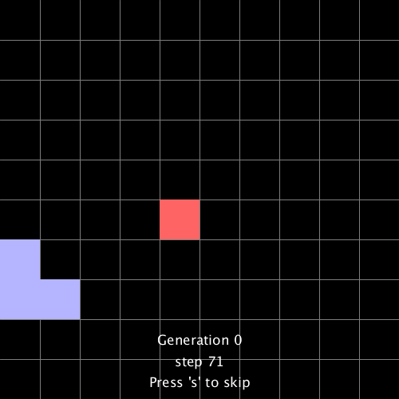
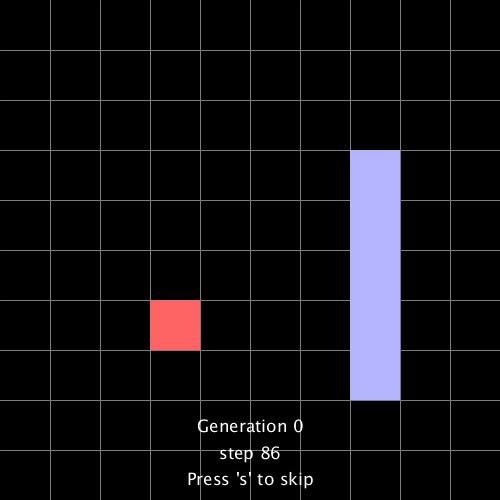
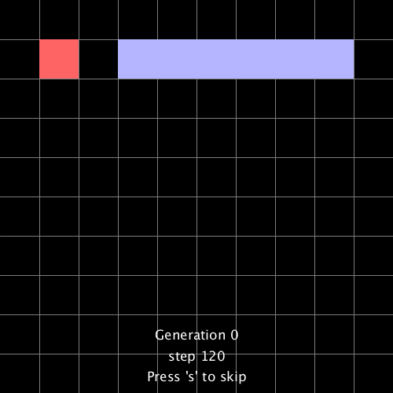

# snake-neuroevolution

## Neural network builder made from scratch
*Like with the great Keras library, I wanted to be able to build neural networks with just a few lines*
```java
nn = new NeuralNet(24);
nn.addLayer(32,"sigmoid");
nn.addLayer(16,"sigmoid");
nn.addLayer(4,"softmax");
```
#### Activation functions supported
- sigmoid
- softmax
- tanh
- relu
- elu

## Plenty of abstraction for neuroevolution
*This is how it looks in the main file*
```java
pop = new Population(140,10,10); // 140 agents, map is 10x10
pop.evolve(0.3,10,200); // 0.3 mutation chance, 10 episodes with 200 steps each
generation++;
```

## Visualise agent progress
   
